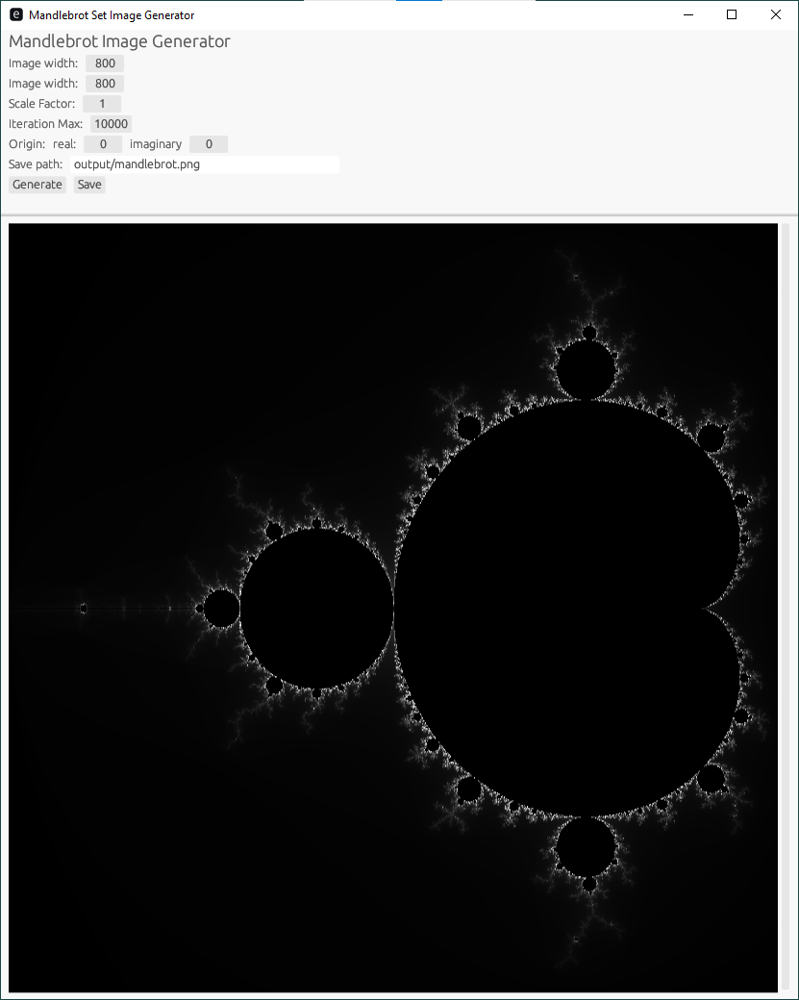

# Summary
A mandelbrot set image generator with a simple gui.

# Installation
1. <a src="https://www.rust-lang.org/tools/install">Install Rust, and cargo</a>
2. run `git clone https://github.com/daniel-j-anderson-dev/mandlebrot_egui.git` in the desiried directory
3. run `cargo run --release` in the root of the repo to run the app
4. The binary can be found in `repo_root/target/release/mandelbrot`

# Screenshot
</img>